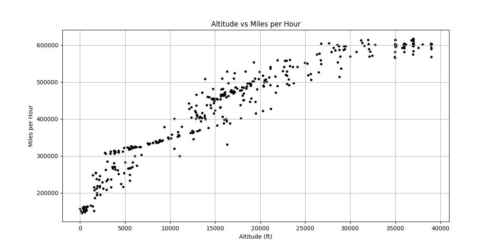

# Altitude vs. Speed Data Analysis

This project analyzes a dataset containing altitude and Mach number readings, converting Mach numbers to Miles per Hour (MPH) and visualizing the correlation between altitude and speed using a scatter plot.

## Files

* `main.py`: The Python script that reads the data, performs the conversion, and generates the plot.
* `alt_vs_speed.csv`: The CSV file containing the raw altitude and Mach number data (expected to be in the same directory as `main.py`).
* `Figure_1.png`: An example of the scatter plot output generated by the script.

## How it Works

The `main.py` script performs the following steps:

1.  **Data Loading:** It safely opens and reads the `alt_vs_speed.csv` file.
2.  **Header Skipping:** The first row (header) of the CSV is skipped to ensure only data is processed.
3.  **Data Extraction:** It iterates through each row of the CSV, extracting altitude and Mach number values.
4.  **Data Cleaning:** Rows with empty altitude or Mach number values are skipped to prevent errors.
5.  **List Population:** Valid altitude and Mach number values are appended to respective lists (`altitude_list` and `mach_number_list`).
6.  **Mach to MPH Conversion:** It then iterates through the `mach_number_list`, converting each Mach number to Miles per Hour (MPH) by multiplying by a standard speed of sound value (767.269 MPH). The converted values are stored in `mph_value_list`.
7.  **Scatter Plot Generation:**
    * A new Matplotlib figure is created with a specified size (12x6 inches).
    * A scatter plot is generated using `altitude_list` for the x-axis and `mph_value_list` for the y-axis.
    * Plot aesthetics are set: point size (`s=10`), color (`#000000` for black), title ("Altitude vs Miles per Hour"), x-axis label ("Altitude (ft)"), and y-axis label ("Miles per Hour").
    * A grid is added to the plot for better readability.
8.  **Display Plot:** The generated scatter plot is displayed.

## How to Run

1.  **Save the files:** Ensure `main.py` and `alt_vs_speed.csv` are in the same directory.
2.  **Install dependencies:** If you don't have them already, install `matplotlib` and `csv` (csv is usually built-in with Python):
    ```bash
    pip install matplotlib
    ```
3.  **Execute the script:** Open a terminal or command prompt, navigate to the directory containing the files, and run the Python script:
    ```bash
    python main.py
    ```
    This will open a window displaying the scatter plot.

## Example Output

The script generates a scatter plot visualizing the relationship between altitude and speed, similar to the image below:

